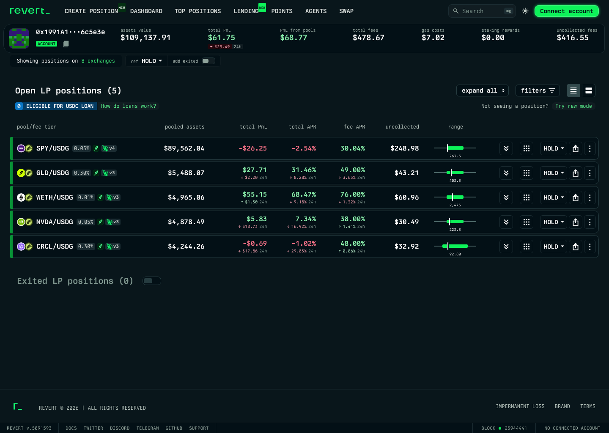
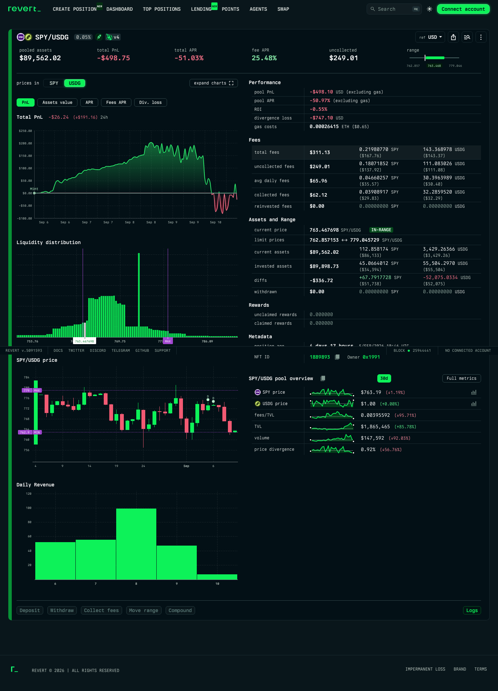

# Revert 参考页观察与 Liqora 取舍

> 观察日期：2026-09-10；公开页面，无钱包连接。 
> 范围：用户提供的账户页、Robinhood Uniswap V4 #1889893 详情及其基准选择；不验证实际链上计算正确性。 
> 本观察最初用于 v1.8 / v0.3；当前文档：[PRD v1.18](https://github.com/JIAMING-LI/liqora-docs/blob/main/prd/current-lp-performance-prd.md)、[UI 需求 v0.22](current-lp-ui-requirements.md)。

## 1. 账户页：紧凑比较有效

[原页面](https://revert.finance/#/account/0x1991A155D8Be7176EB7Eb4207A28E8bb166c5e3e)已等待当前持仓加载完成再截图；初次加载短暂显示 0，未将其当作空钱包结果。

账户顶部把资产、总盈亏、费用、未领取等放在一行，列表直接比较各仓位的 pooled assets、total PnL、total APR、fee APR、uncollected 和 range。用户不必逐一打开仓位才能找到需要关注的 LP，这是本轮主要采用的信息组织方式。

对 Liqora 的调整：同一行并列价值、盈亏及投入比、固定窗口手续费 APR、未领取、区间与周期；顶部汇总现有金额及手续费展示值。本观察最初只含当前 LP；PRD v1.16 已按用户新需求增加 Closed 历史周期，详情复用现有项目。不加入借贷、交易、奖励和多协议入口。

可见风险：参考页部分标签较小，区间示意和方向变化不能只依赖颜色。Liqora 使用中文明确标签、区间文字、正负号及固定 USD 单位。截图只能支持可见设计判断，未据此声称完成可访问性测试。

## 2. 仓位详情：费用去向值得保留，图表不全搬

[原页面](https://revert.finance/#/uniswapv4-position/robinhood/1889893)顶部仍是同组关键指标，下方区分 Performance、Fees、Assets and Range、Metadata；Fees 中可见总费用、未领取、平均每日费用、已领取和已复投。

采用：紧凑的首屏摘要、已领取（含复投）／未领取并列、原币与 USD 对照、本金和区间分组、建仓时长。将“平均每日费用”改为 Liqora 的明确窗口日均，与原有 APR 共用窗口收入。

不采用：多组收益曲线、K 线、池子流动性分布、池子行情、无常损失、奖励、交易按钮。这些会引入独立的历史图表或策略模型，超出已确定的一期监控范围。参考页面内容密集，Liqora 不将每一个字段都做成独立卡片，也不保留大量无内容的零值模块。

## 3. 基准选择：USD 金额不等于 USD 基准

页面初始显示 `ref HOLD`。查看基准说明并选择 USD 后，上方 total PnL 从本次截图的 −26.24 变为 −498.75；这些是页面当时的展示数，不是我们复算的结果，也不能作为当前实时收益。

Revert 的[官方定义](https://docs.revert.finance/revert/position-analytics/uniswap-v4-positions)区分了 HOLD 与 USD：前者将投入代币按现价作持币对照；后者按投入／取回发生时估值。Liqora 固定后者所需的历史收支基准，仍按自己的手续费、Gas 和准备费用规则计算，不复制参考页的公式或 APR 数值。此次未验证切换后所有图表是否同步，因此不据单张截图判定其计算错误。

## 4. 指标映射

| Revert 可见项 | Liqora 处理 | 口径／原因 |
|---|---|---|
| pooled assets | 当前仓位价值 | 不含单独未领取；当前 LP 的现值 |
| total PnL | LP 盈亏／扣准备费用后盈亏 | 固定历史收支 USD 基准，两个成本口径分清 |
| ROI | 投入盈亏比 | P÷累计投入（含复投），非年化；不作为投资回报或时间加权收益率 |
| total APR / pool APR | 不采用 | 保留手续费 APR，避免把币价损益简单年化成另一个主指标 |
| fee APR | 原 1h／24h／7d／30d 手续费 APR | 总览和详情显式标窗口，用实际新增手续费和时间加权本金 |
| total fees | 手续费汇总（展示值） | 历史已领取（含复投）＋当前未领取；不直接用作 APR 或再次加回盈亏 |
| collected / uncollected / reinvested | 合并为 Collected 与 Uncollected 两行 | 复投按领取再投入记账；已领取按结算时，未领取按当前 |
| avg daily fees | 窗口日均手续费 | 同窗口新增÷天数；1h 标为折算日均，非预测 |
| gas costs | LP 操作 Gas | 按实际支付时 USD；准备 Gas 仅在可选关联中扣且去重 |
| current / invested / withdrawn assets | 本金与资金变化 | 当前、创建、外部追加、取回分清，不把投入全部按现价改写 |
| range / position age | 区间及本次周期时长 | 总览可直接判断，NFT 转移不重置周期 |
| divergence / rewards / pool charts / exited / actions | 不采用 | 不扩展一期范围 |

## 5. 新展示指标自检

- 普通样例：K 10,200、U 40、H 60、I 10,000、Gas 5，P 仍为 295；手续费汇总为 100，不能再加一次。投入盈亏比 2.95%。
- 直接复投：未领取 100 转入本金后，汇总显示为已领取 100，同时 H 与 I 各增加 100，盈亏连续。缺复投结算估值时，相关已领取、投入和盈亏暂不可计算。
- 可选费用：关联 19.20 后 P 为 275.80、比值 2.758%；手续费汇总和 APR 不受关联变化影响。
- 窗口日均：1h 新增 1 → 折算日均 24；7d 新增 40 → 日均约 5.71；不能把折算值当成已经赚取的全天收入。

## 6. 交付边界

三步参考观察均已完成并保留实际截图；只读检查了页面加载、指标分组及基准切换，未测试钱包交易、真实估值、全部图表交互或完整无障碍支持。

参考后提供三版视觉方案，用户选择第三版并要求一期英文、低饱和色调。该方向曾实现为 v0.4。随后用户提供 Dashboard-2 参考，现有 v0.14 改为统计、当前快照图表、LP 列表的首屏，沿用已确认的指标与费用流程；展示数据仍为构造数据，真实链上计算和产品功能仍按 PRD 另行验收。
